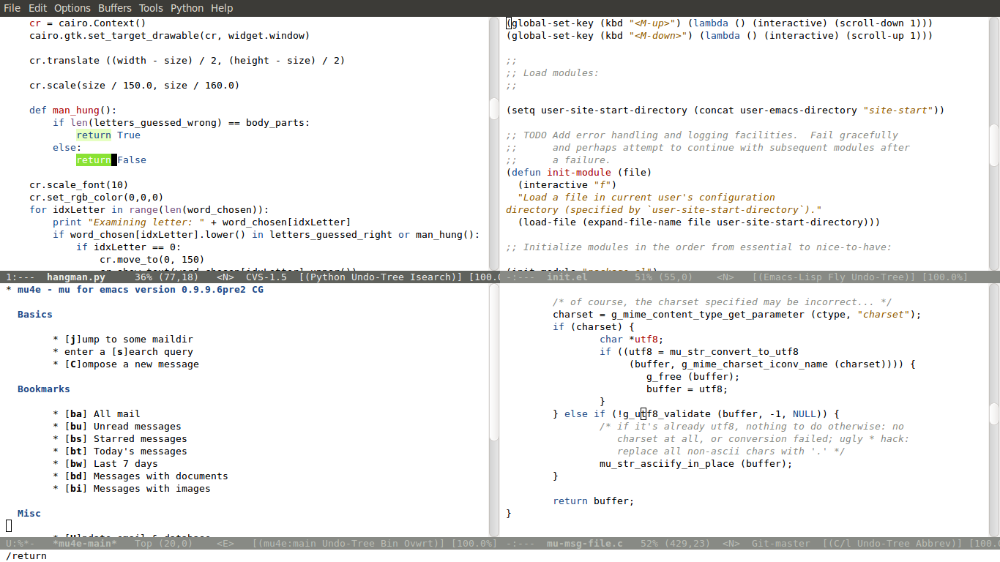
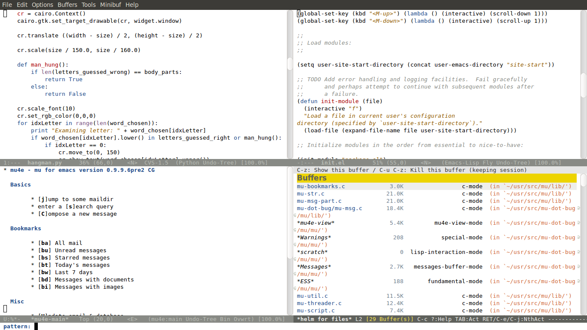

Tango Plus Theme
================

Color theme for Emacs loosely based on the tango palette.  As all
themes, this is a work in progress.  The basis for this theme was the
tango theme that is part of Emacs 24.  However, some colors where
added to increase contrast.  Also, support was added for evil, org
mode, mu4e, helm, and markdown-mode among others. 

## Installation

Have Emacs 24 or higher.  Put the file tango-plus-theme.el in a
directory included in your load-path.  Add the following line to your
start-up file (typically init.el):

    (load-theme 'tango-plus t)

Alternatively, you can install from
[MELPA](http://melpa.milkbox.net/#/tango-plus-theme).

## Screenshots

Note that the colors look more vivid in the screenshots than they are
in Emacs, perhaps that's due to the compression, not sure.

## Design principles

The goal of the theme is to support visual perception and to
facilitate comprehension of code and text markup.  This may sound
trivial but some themes instead try to look cool at the cost of
ergonomics.

Principle 1: Use colors sparingly.  Give the user subtle hints and
avoid disrupting the reading process.  For example, coloring LaTeX
macros interspersed in text with red would disrupt reading by
attracting too much attention.

Principle 2: Use colors as semantic annotation: the meaning of a color
should be self-explanatory and consistent across buffers and
languages.  For example, red background is for errors (flyspell) and
stuff that was (ediff) or is going to be deleted (search & replace in
evil).  Green background is for matches (isearch) or inserted material
(ediff).  Selections are marked with yellow background, think text
marker.  All neutral types of highlights use a light grey for the
background (sentence-highlight-mode, hl-line-mode,
show-paren-match).  Foreground colors: Blue is used for keywords
(electric sparks).  Newly defined stuff like functions is red (hot
from the forge).  String constants are brown like burned
bricks.  Comments are grey.
